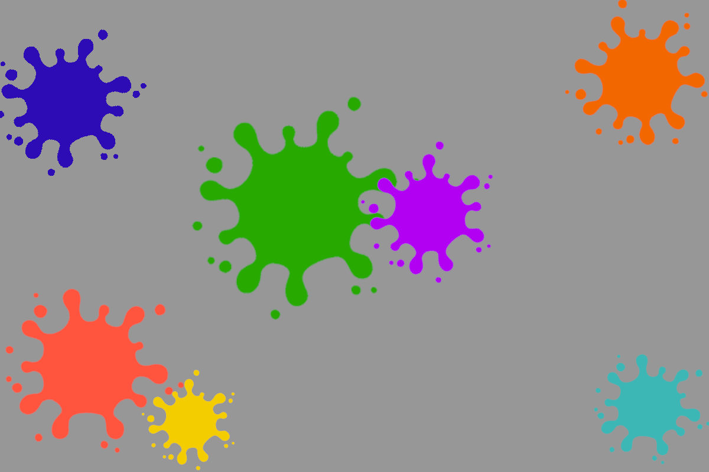

# Memoria del Proyecto

## Introducción

El proyecto tiene una finalidad de servir como ejemplo de las materias vistas durante el curso y está basado en un diseño responsive, que asegura una correcta visualización en dispositivos con diferentes tamaños de pantalla. Se ha trabajado en un entorno de desarrollo que incluye herramientas modernas como Visual Studio Code, GitHub y el uso de fuentes e iconografía específicas.

## Metodología

### Investigación y Análisis

La metodología de desarrollo de este proyecto ha seguido un enfoque centrado en el usuario final y en la adaptabilidad de la interfaz. Se realizó un estudio preliminar de las siguientes áreas:
  
- **Requerimientos del cliente**: Se obtuvo del juego original paletas de colores, un logo, y otras imágenes representativas necesarias para el proyecto.

- **Definición del estilo visual**: Se utilizaron como referencia paletas del juego de origen,

### Desarrollo

El proceso de desarrollo se llevó a cabo en las siguientes fases:

1. **Configuración del Entorno de Desarrollo**:
   - **Visual Studio Code (VSC)** fue utilizado como editor de código.
   - Se instalaron y configuraron las extensiones **Emmet** y **Live Server** para facilitar el desarrollo de HTML y CSS.
   - **Git** fue utilizado para el control de versiones, y **GitHub** para la gestión del código fuente y el versionado del mismo
   
2. **Diseño Visual**:
   - Para la tipografía, se uso una fuente hecha por fans basada en la tipografia oficial del juego.
   - Para los colores se usaron referencias a las paletas ya generadas para el juego de origen
     - Colores vivos variados, sin tonos muy oscuros
     - 

3. **Maquetación**:
   - La página fue diseñada usando **HTML5 semántico**, asegurando el uso adecuado de etiquetas como `<header>`, `<nav>`, `<article>`, `<footer>`, entre otras.
   - **CSS Flexbox** y **CSS Grid** fueron utilizados para la maquetación responsive, adaptándose a diferentes tamaños de pantalla.

4. **Implementación con Bootstrap**:
   - Se implementó el **framework Bootstrap** para agilizar el desarrollo y asegurar la compatibilidad con diferentes dispositivos y tamaños de pantalla.
   - Se aprovechó el **grid system** de Bootstrap para gestionar la disposición de los elementos en la página.

5. **Pruebas y Ajustes**:
   - La página fue testeada en diferentes dispositivos (móviles, tabletas, y escritorios) para asegurar su correcta visualización.
   - Se realizaron ajustes en el diseño según los resultados de las pruebas, mejorando la usabilidad y la accesibilidad.

## Justificación de las Soluciones Adoptadas

### Elección del Framework

La elección de **Bootstrap** como framework para el proyecto se basó en su popularidad y facilidad de uso. Además, su sistema de **grid** y los **componentes predefinidos** permitieron una implementación más rápida y consistente, especialmente en términos de diseño responsive. Bootstrap también ofrece una gran compatibilidad con la mayoría de los navegadores y dispositivos, lo que asegura una buena experiencia de usuario.

### Diseño Responsive

La adaptabilidad de la página se logró gracias al uso de **CSS Grid** y **Flexbox** en combinación con las clases de **Bootstrap**. Estas tecnologías permiten que la página se ajuste automáticamente al tamaño de la pantalla del dispositivo, proporcionando una experiencia de usuario consistente sin importar el dispositivo utilizado.

## Guía de Estilos

### Imagenes
- **Fondo de la web**: El fondo de la web ha sido creado desde cero usando colores variados.
- **Caratulas de juegos**: Las caratulas de cada juego fueron obtenidas de la wiki oficial del juego .

<!--|  | Imagen de fondo |-->
<!--| :----------------------------------------------: | :-------------------------------------------------------------------------------------------------------------------------------------------------: |-->

### Colores

- **Color principal**: `#1414bf` (Azul oscuro).
- **Color secundario**: `#ff590d` (Naranja).
- **Color de fondo**: `gray` para el cuerpo de la página.
- **Textos**: Predominantemente en color blanco para garantizar contraste y legibilidad.

### Tipografía

- **Fuentes principales**: Se utilizaron fuentes **sans-serif** de **Google Fonts**, como **Roboto** para los textos y **Poppins** para los encabezados.

### Layout

- **Estructura de la página**: La página se divide en varias secciones semánticas como el encabezado, el cuerpo y el pie de página.
- **Sistema de grid**: Se utilizó el sistema de **grid de Bootstrap** para gestionar el diseño responsivo, permitiendo que la página se ajuste correctamente en diferentes dispositivos.

## Conclusión

El proyecto demuestra el uso y aplicacion de diversas tecnologias para la creacion de una pagina agradable a la vista y adaptativa a multiples dispositivos.

